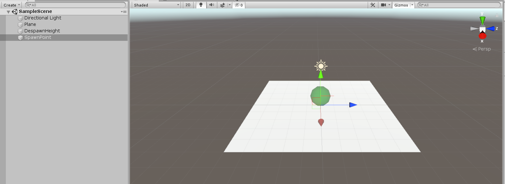
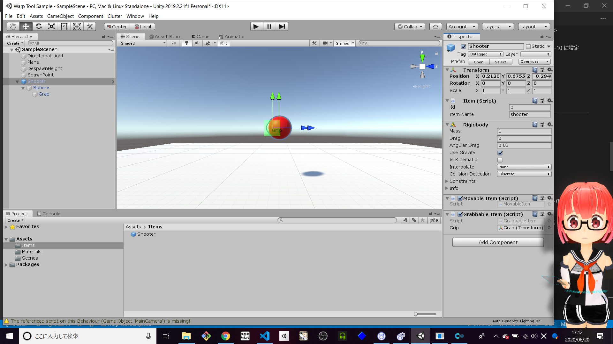
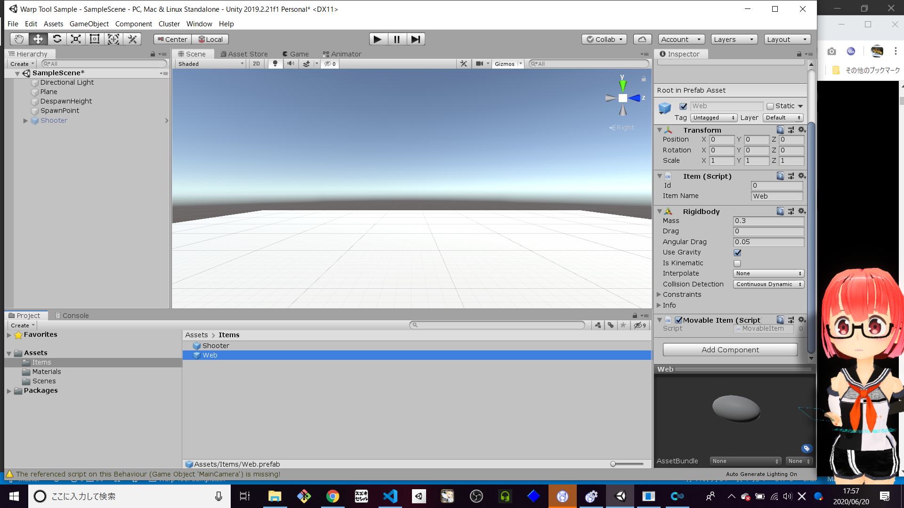
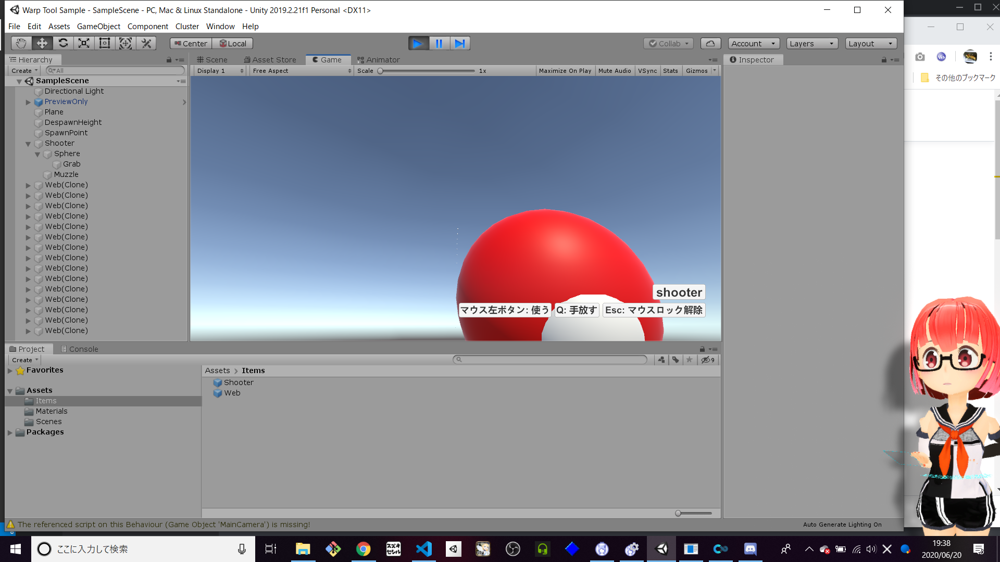
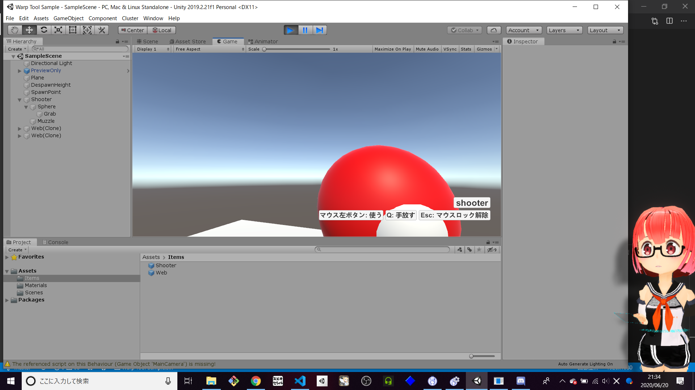
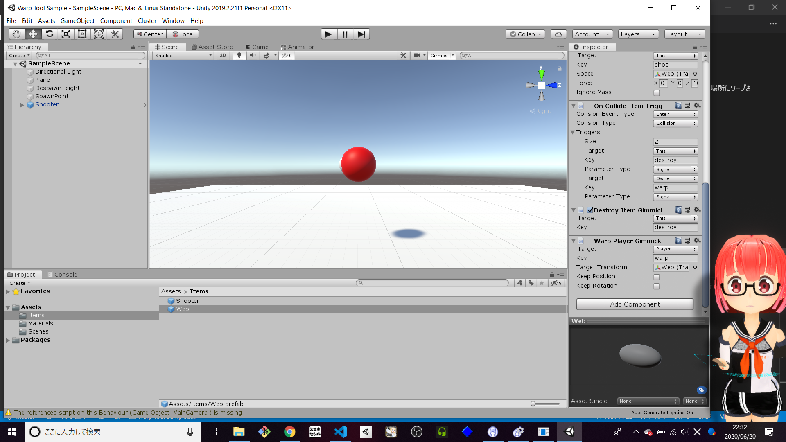
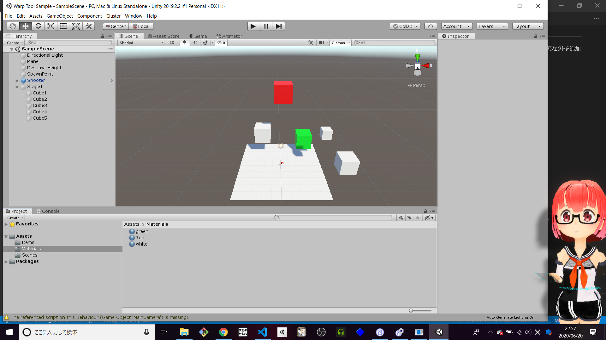

# Cluster ワープ銃　サンプル
トリガー・ギミックを利用したサンプルワールドです。
Cluster 公式のサンプルワールド ワープガン　や ハトソードのように自キャラをワープさせる場合の参考です。  
プロジェクト設定やワールド作成の部分から説明してるので不要な方は `ワープ銃実装` から参考に。

# Cluster サンプルワールド
[Warp Tool Sample](https://cluster.mu/w/7417e09e-a7e1-4b60-94ce-bdba5926fa37)

# 準備
## Unity 2019.2.21f1 のインストール
Unity 2019.2.21f1 じゃない場合、アップロードしたワールドへ入れないので、必ずこのバージョンが必要です。  

- [Unity Hub](https://unity3d.com/jp/get-unity/download) をダウンロードしてインストールする。
- [Unity ダウンロード アーカイブ](https://unity3d.com/jp/get-unity/download/archive)  から `Unity 2019.2.21f1` を選んでインストールする。

追加モジュール
- Android Build Support
- iOS Build Support
- Mac Build Support (Mono)
- 
#### 参考
- [【cluster】すぐ出来る！ワールド作成の始め方](https://creator.cluster.mu/2020/02/27/helloworld/)

## プロジェクト設定,環境設定  

プロジェクを作ったら初めに設定する項目です。  
ワールドのアップロードは時間かかるのでこの設定をすると軽減できるようです。  

### Project Settings
プロジェクト設定で変更必要な箇所
- Player > Other Settings > Rendering > Color Space  
値 Linear
-  Editor > Asset Pipeline  
値 Asset Pipeline v2

### Preferences  
環境設定で変更必要な箇所  
- General　> Compress Assets on Import  
値 false (チェックを外す)

#### 参考
- [Creator Kitの導入](https://clustervr.gitbook.io/creatorkit/installation/install-creatorkit/)
- [clusterワールドアップロード(ビルド)高速化tips](https://twitter.com/noir_neo/status/1236619014165549058?s=20)

## Cluster Creator Kit の導入

# 最低限必要な要素の配置

## ワールドに必要な要素
- SpawnPoint  
プレイヤーの出現ポイント
- DespawnHeight  
プレイヤーが消滅する高さ
- Collider  
衝突可能なオブジェクト

1. `Main Camera` は使わないので削除する
2. 床を追加する  
   1. `Hierarchy` で右クリック `3D Object` > `Plane` を追加
   2. `Plane` に `Mesh Collider` がついている事を確認する。
3. `SpawnPoint` を追加する  
   1. `Hierarchy` で右クリック `Create Empty` を追加
   2. 追加された `GameObject` の `Inspector` で `Add Component` > `SpawnPoint` を追加
4. `DespawnHeight` を追加する
   1. `Hierarchy` で右クリック `Create Empty` を追加
   2. 追加された `GameObject` の `Inspector` で `Add Component` > `DespawnHeight` を追加
   3. `Plane` より下に配置したいので `Transform` の `Position` `Y` を -10 に設定

#### 参考
- [ワールド作成の基礎を学ぼう](https://creator.cluster.mu/2020/03/03/learn-world-basic/)

# ワープ銃の実装

## 手に持てるアイテム
ここでは `Grabbable Item` を使います。持ち手となるアイテムも設定します。

1. `Hierarchy` で右クリック `Create Empty` で `GameObject` を追加　　
    - 追加した `GameObject` の名前を `Shooter` に設定
2.  見た目として `Sphere` を追加  
    - Scaleを 0.3 に設定。  
3.  持ち手を追加するため `Sphere` 下にもう一つ `Sphere` を追加する 
    - 追加した Sphere の名前を `Grab` にする
    - Scale 0.5 
    - Position Z -0.3
4.  銃口を追加するため `Sphere` 下に `GameObject` を追加する 
    - 追加した Sphere の名前を `Muzzle` にする
    - Position Z 0.3
6. `Shooter` の `Inspector` で `Add Component` > `Grabbable Item` を追加
7. `Grabbable Item` の Grab に Sphere の名前 `Grab` を設定する
8.  `Shooter` を `Prefab` にする
   1. `Assets` に Folderを追加 `Items` 等の名前にする
   2. Items に `Hierarchy` の `Shooter`　を ドラッグ＆ドロップする
   3. 青いアイコンに変わり Prefab化される
9. `再生ボタン` を押して `Shooter` が持てるか確認してみる。

### 弾のObjectを作成する
ここでは `Items` を使います。

1. 弾にする `GameObject`　を作成して名前を `Web` と設定する
2. `Inspector` で `Add Component` > `Movable Item` を追加  
3. Movable Item で自動追加された `Item` の設定を変更する  
   - `Item Name` `Web` 
4. Movable Item で自動追加された `Rigidbody` の設定を変更する  
   - `Collision Detection`（衝突検知）`Continuous Dynamic`  
   - `Mass` 0.3 
5. `Web` の下に 弾の見た目 `Sphere` を追加  
   - Scale 0.1,0.1,0.2 
6. Prefab化する為に `Assets` > Items に `Hierarchy` の `Web`　を ドラッグ＆ドロップする
7. 青いアイコンに変わり Prefab化される
8. `Hierarchy` にある `Web` は削除しておく。

## 使うで弾を発射する
ここでは `Use Item Trigger`, `Create Item Gimmick` を使います。
Prefab化した `Shooter` に弾を発射するギミックを追加していきます。

1. `Assets` Items にある `Shooter` を選択する
2. `Inspector` で `Add Component` > `Use Item Trigger` を追加
3. `Down Triggers` の設定をする
    - Size 1
    - Target This
    - Key fire
    - Parameter Type Signal
4. `Create Item Gimmick` を追加  
    - Key fire
    - `Item Template` の `Assets` Items にある `Web` を設定
    - `Spawn Point` を `Muzzle` に設定
5. `再生ボタン` を押して `Shooter` が持て使えるがでるか確認してみる。

#### 参考
[Use Item Trigger](https://clustervr.gitbook.io/creatorkit/triggers/use-item-trigger)  
[Create Item Gimmick](https://clustervr.gitbook.io/creatorkit/gimmicks/create-item-gimmick)

## 弾が生成されたときの動きを設定
ここでは `On Create Item Trigger` と `Add Instant Force Item Gimmick` を使います。
Prefab化した `Web` に生成時に飛んでいくトリガーとギミックを追加していきます。

1. `Item Template` に `Assets` Items にある `Web` を選択する
2. 生成されたときのトリガー `On Create Item Trigger` を追加する
    - Size 1
    - Target This
    - key shot
    - Parameter Type Signal
3. 生成されたとき力を加える `Add Instant Force Item Gimmick` を追加する
    - Target This
    - key shot
    - Force Z 10
4. `再生ボタン` を押して `Shooter` が持て弾がでるか確認してみる。

## 弾が何かに当たったら消えるようにする
ここでは `On Collide Item Trigger` `Destroy Item Gimmick` を使います。
必要以上にオブジェクトを描画することは負荷になるようなので、
Prefab化した　`Web` に当たったら消えるトリガーとギミックを追加していきます。

1. `On Collide Item Trigger` を追加
    - `Collision Event Type` Enter
    - `Collision Type` Collision
    - `Target` This
    - `Key` destroy

1. `Destroy Item Gimmick` を追加する
    - `Target` This
    - `Key` destroy
2. `再生ボタン` を押して `Shooter` で弾が消えるか確認してみる。

#### 参考
[On Collide Item Trigger](https://clustervr.gitbook.io/creatorkit/triggers/on-collide-item-trigger)  
[Destroy Item Gimmick](https://clustervr.gitbook.io/creatorkit/triggers/on-collide-item-trigger)

## 当たった場所にプレイヤーをワープさせる
ここでは `Warp Player Gimmick` を使います。  
弾が当たった場所へ プレイヤーをワープさせます。
Prefab化した　`Web` に当たった場所にワープさせるトリガーとギミックを追加していきます。

1. `Item Template` の `Assets` Items にある `Web` を選択する
2. `On Collide Item Trigger` の Size を 2 に変更
    - `Target` Owner
    - `Key` warp
    - `Parameter Type` Signal
3. `Warp Player Gimmick` を追加する  
    - `Target` Player
    - `Target Transform` Web (Prefabをドラッグ＆ドロップ)
4. `再生ボタン` を押して `Shooter` で 床に弾を打ってワープするか確認してみる。

# ワープできるポイントを増やしてみる
床だけだとツマラナイので、高くのぼれたり離れた場所に飛べるよう
足場になるオブジェクトを追加してみます。

1. `Hierarchy` で右クリック `Create Empty` で `GameObject` を追加　　
    - 追加した `GameObject` の名前を `Stage1` に設定
2. `Stage1` の下に `Cube` を追加する
    - `Position` 3,1,4
    - `Scale` 2,2,2
3. `Cube` に `Box Collider` がついている事を確認する
4. ほかにも適当に `Collider` ついたオブジェクトを増やす
4. `再生ボタン` を押して `Shooter` で Cube に弾を打ってワープするか確認してみる。
